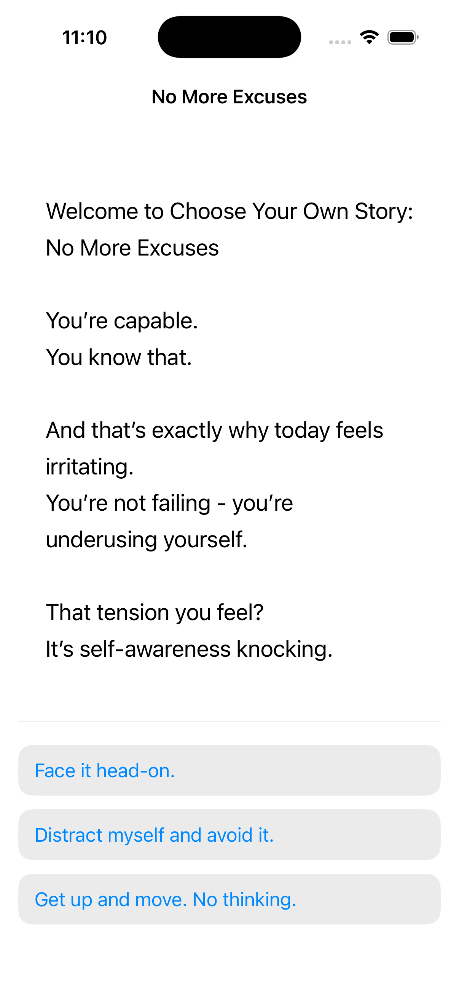
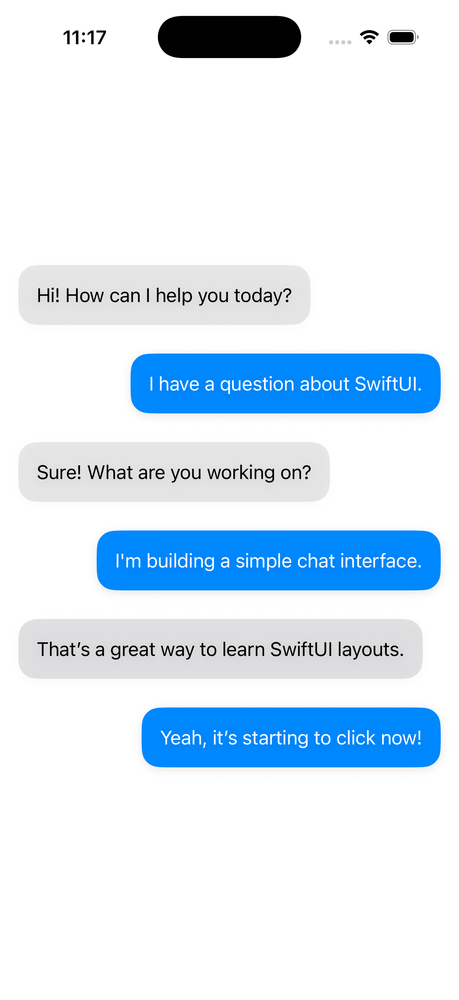
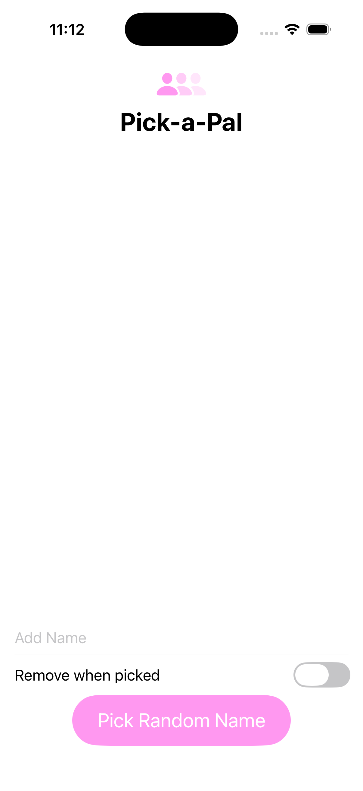
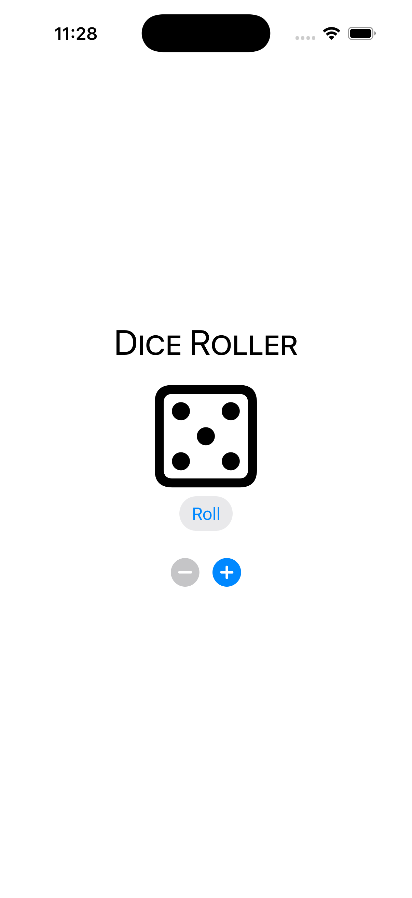
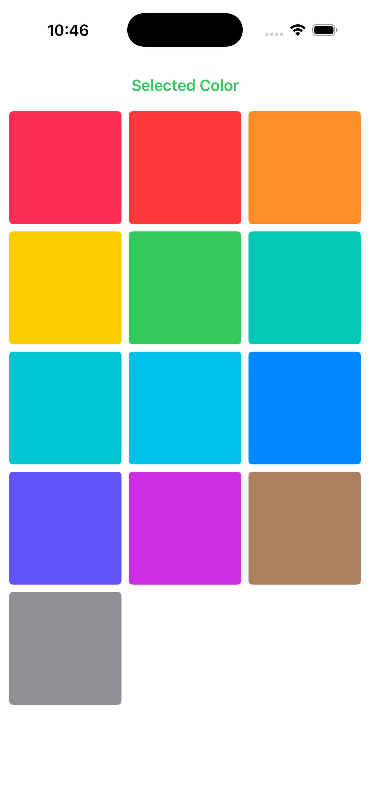
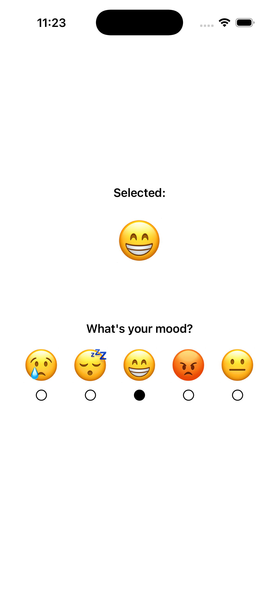
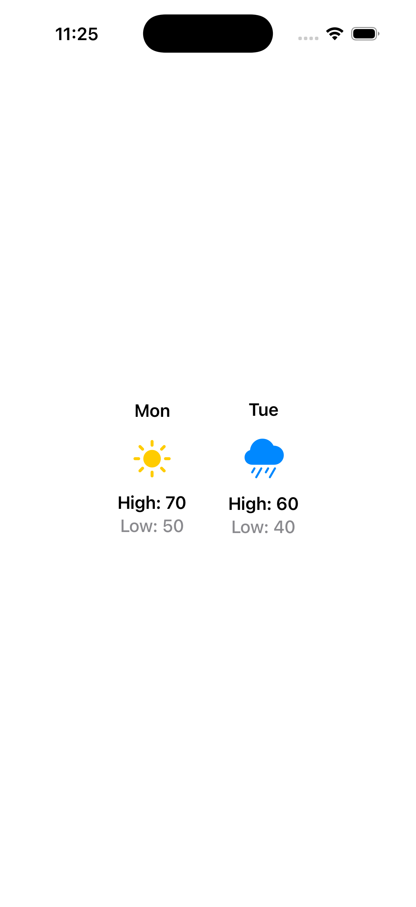

# SwiftUI Mini Prototypes

A collection of smaller SwiftUI builds and interface experiments created to strengthen hands-on iOS development skills through focused practice.

## Overview

This repository brings together multiple mini SwiftUI prototypes that I built to practice layout design, navigation, state handling, interactivity, and reusable UI structure. Instead of one large app, this repo shows a range of smaller concepts that helped me build confidence in SwiftUI through repetition and experimentation.

## Included Mini Prototypes

- **Story** – a choice-based text experience with branching screens
- **Chat Prototype** – a simple conversation-style interface for practicing message layout
- **Color Grid** – a visual color selection prototype
- **Dice Roller** – a lightweight interactive dice-rolling interface
- **Forecast Prototype** – a basic weather-style display experiment
- **Mood View** – a mood selection interface using emoji-based interaction
- **Pick-a-Pal** – a random name picker with optional remove-on-pick behavior
- **Alphabetizer** – a simple prototype for practicing list-based sorting logic
- **Onboarding Flow** – a small interface experiment focused on app entry flow

## Built With

- Swift
- SwiftUI
- Xcode

## Screenshots

### Story Prototype
A choice-based story interface built to practice branching navigation and text-driven screen flow.

### Chat Prototype
A simple conversation UI used to practice message bubbles, spacing, and layout structure.

### Pick-a-Pal
A random picker interface for selecting names from a custom list.

### Dice Roller
A lightweight interactive prototype for rolling dice and adjusting the number of dice shown.

### Color Grid
A visual color-selection prototype focused on simple interaction and grid layout.

### Mood View
An emoji-based mood selection interface built to explore basic interactive state changes.

### Forecast Prototype
A simple weather-style layout experiment built to practice icon placement, spacing, and structured daily display.

## What This Repository Demonstrates

- SwiftUI layout practice
- Navigation experiments
- State-driven UI updates
- Reusable component thinking
- Interactive mobile interface design
- Rapid prototyping across different app ideas

## Why I Built This

I wanted a place to keep smaller SwiftUI experiments that still mattered to my growth as an iOS developer. These mini projects helped me practice one concept at a time, move faster, and get more comfortable building interfaces from scratch.

## Status

Completed as an iOS practice and portfolio prototype collection.

## Author

**Jessica Vargas**  
Data Analytics Student | App Developer 
